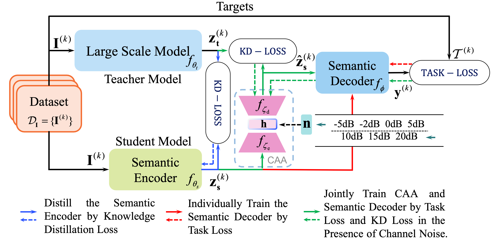
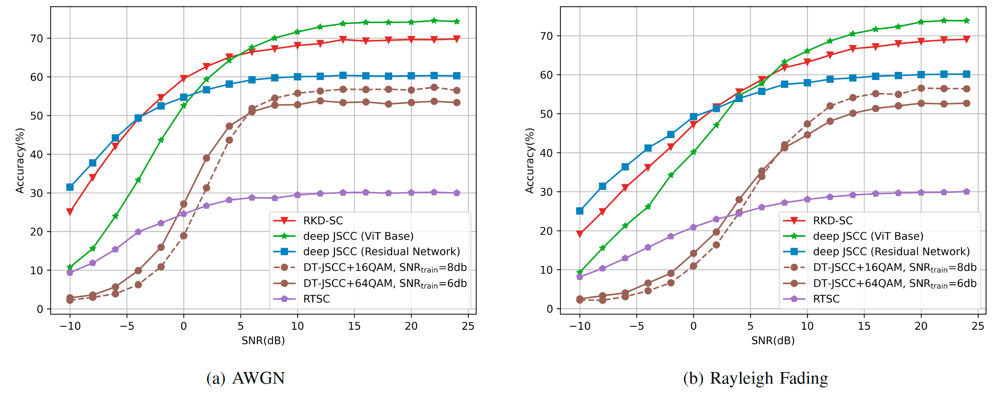

# Large Scale Model Enabled Semantic Communications Based on Robust Knowledge Distillation

This repository contains the implementation code for the paper:
**Large Scale Model Enabled Semantic Communications Based on Robust Knowledge Distillation**

This paper proposes a semantic communication system based on robust knowledge distillation (RKD-SC) for the lightweight application of large-scale semantic coding networks. We found the problem of degraded robustness to noise in deep joint source and channel coding (JSCC) systems that are not trained jointly and propose a channel-aware autoencoder (CAA) based on the Transformer architecture to enhance the robustness of knowledge distillation-based semantic communication systems to channel noise.

## Abstract


Large scale artificial intelligence (AI) models possess excellent capabilities in semantic representation and understanding, making them particularly well-suited for semantic encoding and decoding. However, the substantial scale of these AI models imposes unacceptable computational resources and communication delays. To address this issue, we propose a semantic communication scheme based on robust knowledge distillation (RKDSC) for large scale model enabled semantic communications. In the considered system, a transmitter extracts the features of the source image for robust transmission and accurate image classification at the receiver. To effectively utilize the superior capability of large scale model while make the cost affordable, we first transfer knowledge from a large scale model to a smaller scale model to serve as the semantic encoder. Then, to enhance the robustness of the system against channel noise, we propose a channel-aware autoencoder (CAA) based on the Transformer architecture. Experimental results show that the encoder of proposed RKD-SC system can achieve over 93.3% of the performance of a large scale model while compressing 96.67% number of parameters.

## Quick Start

Follow these steps to quickly get started with training and evaluating the proposed system:

1. **Clone the Repository:**

   ```bash
   https://github.com/echojayne/RKD-SC.git
   cd RKD-SC
   ```
2. **Install Dependencies:**

    Ensure you have Python 3.8 (or later) installed. Install the required Python packages using pip:
    ```bash
    pip install -r requirements.txt
    ```
3.	**Configure Hyperparameters:**

    Update the configuration file (`RKD-SC/experiments/config.json`) to set data path, training parameters, learning rates, batch sizes, and other options.
4.	**Training:**

    To train the semantic communication system with robust knowledge distillation, run the notebook: `RKD-SC/experiments/distillation_student.ipynb`

## Repository Structure
A typical structure of the repository is as follows:

```markdown
├── README.md               # This file
├── requirements.txt        # List of required Python packages
├── models/                 # Contains model definitions
├── results/                # Save the trained models
├── utils/                  # Utility functions 
└── experiments/            # Experimental notebooks and scripts for analysis
```
## Experimental Results

Our experiments demonstrate that the proposed RKD-SC system significantly improves robustness under noisy channel conditions compared to conventional JSCC methods. Detailed experimental results and analysis can be found in the paper and supplementary materials included with this repository.

## Contact
For any questions or suggestions, please contact [dingkuiyuan@bupt.edu.cn]