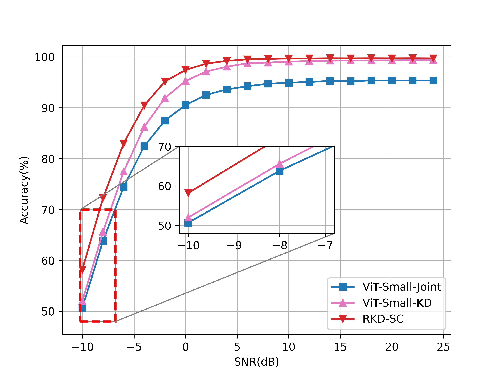
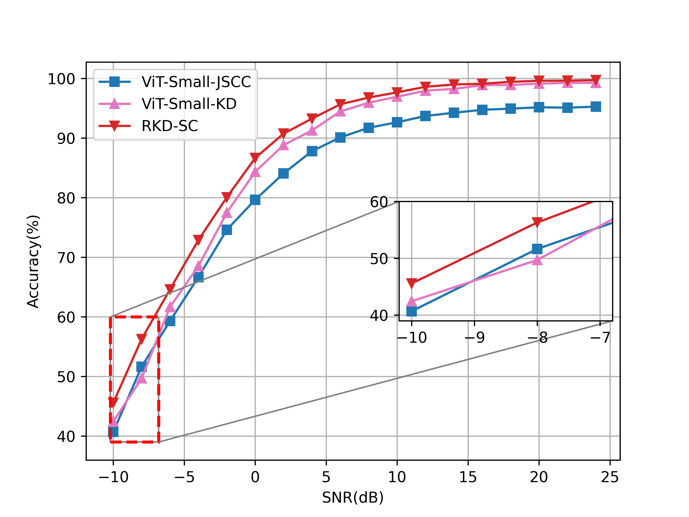
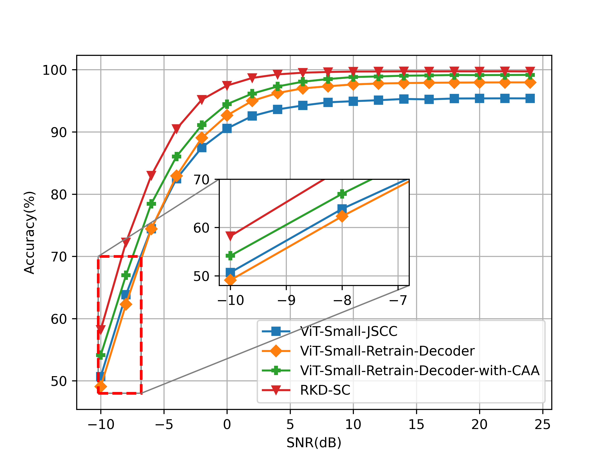
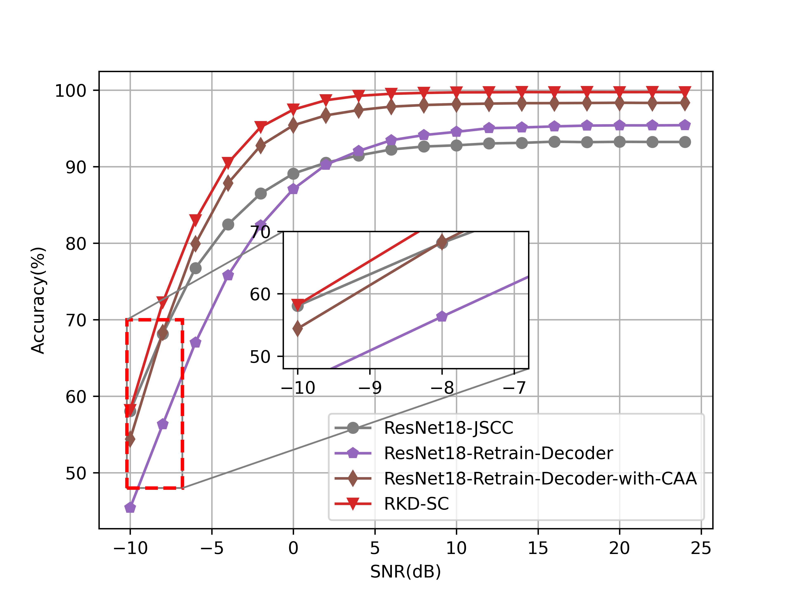
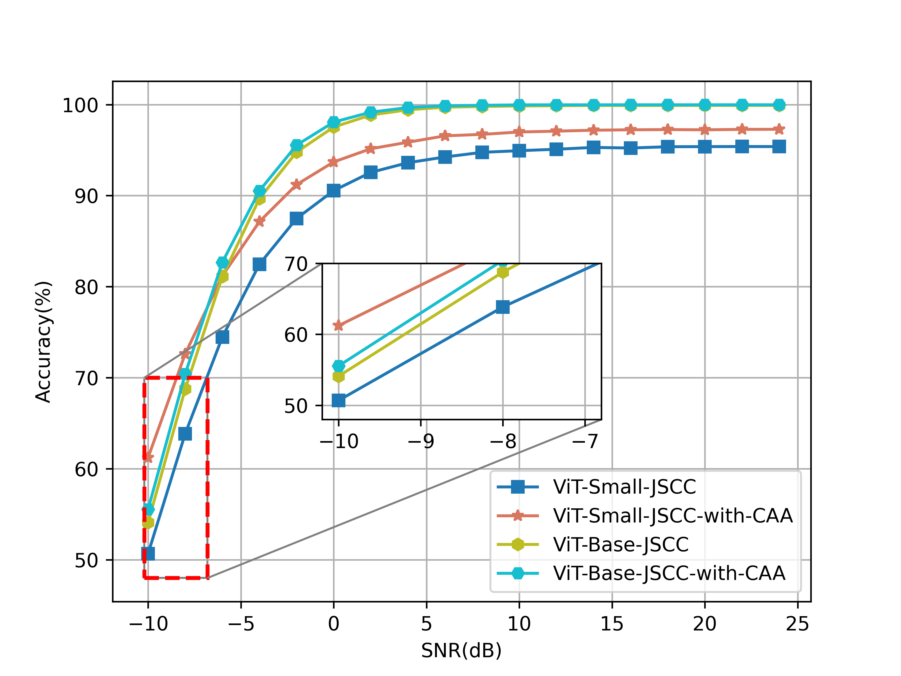
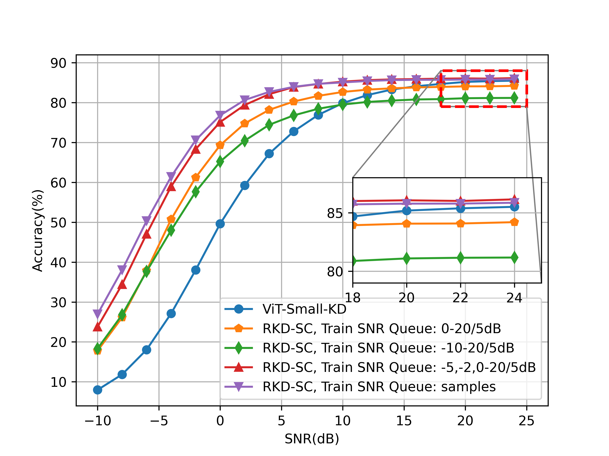

# A Semantic Communication System Based on Robust Knowledge Distillation

This paper proposes a semantic communication system based on robust knowledge distillation (RKD-SC) for the lightweight application of large-scale semantic coding networks. We identify the problem of degraded robustness to noise in deep joint source and channel coding (JSCC) systems that are not trained jointly and propose a channel-aware autoencoder (CAA) based on the Transformer architecture to enhance the robustness of knowledge distillation-based semantic communication systems to channel noise.

## Requirements

- certifi
- ftfy
- numpy
- Pillow
- regex
- torch
- torchvision
- typing-extensions
- wcwidth

You can install the required packages using the following command:
```bash
pip install -r requirements.txt
```

## Getting Started

The code for all experiments is in the experiments folder, you can run the jupyter notebook to try the code.

- distill_student.ipynb: distill the teacher model to student,
- e2e_train_student.ipynb: train the ViT-Small model and semantic decoder end-to-end,
- joint_train_with_ae.ipynb: train the CAA and decoder jointly,
- JSCC.ipynb: the experiments of ResNet18, 
- retrain_teacher.ipynb: fine-tune the teacher,
- test_on_SNR.ipynb: test the model on multiple SNR levels.

## Result

 |  | 
--- | ---
 |  |  
